# Ractor Design Document: Erlang/OTP Concepts in Rust

## Executive Summary

Ractor is a pure-Rust actor framework inspired by Erlang's `gen_server`. This document maps Erlang/OTP concepts to their Rust equivalents in Ractor, detailing the architectural decisions, type constraints, and trade-offs.

---

## Table of Contents

1. [Architecture Overview](#1-architecture-overview)
2. [Process Model: Erlang vs Ractor](#2-process-model-erlang-vs-ractor)
3. [OTP Behaviours Mapping](#3-otp-behaviours-mapping)
4. [Supervision Trees](#4-supervision-trees)
5. [Fault Tolerance & Panic Handling](#5-fault-tolerance--panic-handling)
6. [Data Storage (ETS/DETS Equivalents)](#6-data-storage-etsdets-equivalents)
7. [Type System & Constraints](#7-type-system--constraints)
8. [Code Loading & Execution](#8-code-loading--execution)
9. [Distributed Ractor](#9-distributed-ractor)
10. [Comparison Matrix](#10-comparison-matrix)

---

## 1. Architecture Overview

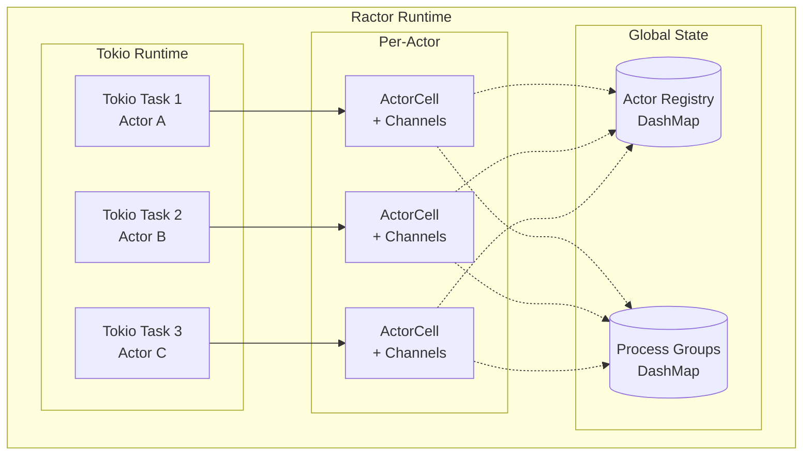

### Core Components

| Component | Rust Type | Purpose |
|-----------|-----------|---------|
| Actor Runtime | Tokio task | Executes actor's processing loop |
| Actor Identity | `ActorCell` | Reference-counted handle to actor's channels |
| Typed Reference | `ActorRef<TMsg>` | Type-safe wrapper for sending messages |
| Message Channels | `mpsc` + `oneshot` | Priority-based message delivery |
| Registry | `DashMap<Name, ActorCell>` | Global name-to-actor lookup |
| Process Groups | `DashMap<Group, Vec<ActorCell>>` | Multi-actor grouping for broadcast |

---

## 2. Process Model: Erlang vs Ractor

### 2.1 Process Mapping

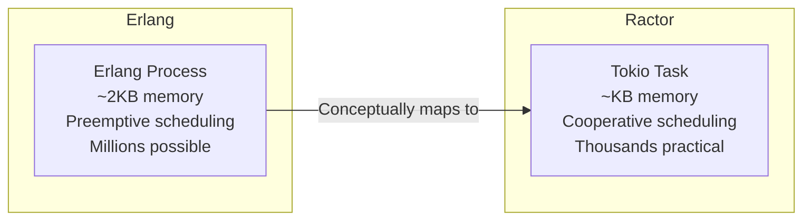

### 2.2 Process Internals

**Erlang Process:**
- Lightweight (~2KB initial heap)
- Preemptive scheduling by BEAM VM
- Reduction counting for fairness
- Per-process garbage collection
- Ordered mailbox (FIFO per sender)

**Ractor Actor (Tokio Task):**
- Heavier (Rust async task overhead)
- Cooperative scheduling (must yield at `.await`)
- No automatic preemption
- Rust's ownership model (no GC)
- Priority channels (not strictly FIFO)

### 2.3 Actor Lifecycle

```mermaid
stateDiagram-v2
    [*] --> Unstarted: spawn()
    Unstarted --> Starting: start()
    Starting --> Running: pre_start() success
    Starting --> Stopped: pre_start() error
    Running --> Running: handle messages
    Running --> Draining: stop() called
    Draining --> Stopping: queue empty
    Stopping --> Stopped: post_stop() complete
    Running --> Stopped: Signal;;Kill
    Running --> Stopped: panic (supervision notified)
    Stopped --> [*]
```

### 2.4 Message Priority System

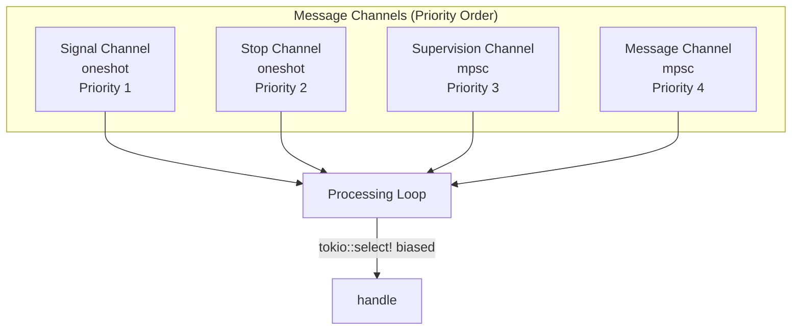

**Rust Implementation:**
```rust
// From actor_cell.rs - Priority selection
crate::concurrency::select! {
    // Highest priority first (biased select)
    signal = &mut self.signal_rx => {
        signal.map(ActorPortMessage::Signal)
    }
    stop = &mut self.stop_rx => {
        stop.map(ActorPortMessage::Stop)
    }
    supervision = self.supervisor_rx.recv() => {
        supervision.map(ActorPortMessage::Supervision)
    }
    message = self.message_rx.recv() => {
        message.map(ActorPortMessage::Message)
    }
}
```

---

## 3. OTP Behaviours Mapping

### 3.1 gen_server → Actor Trait

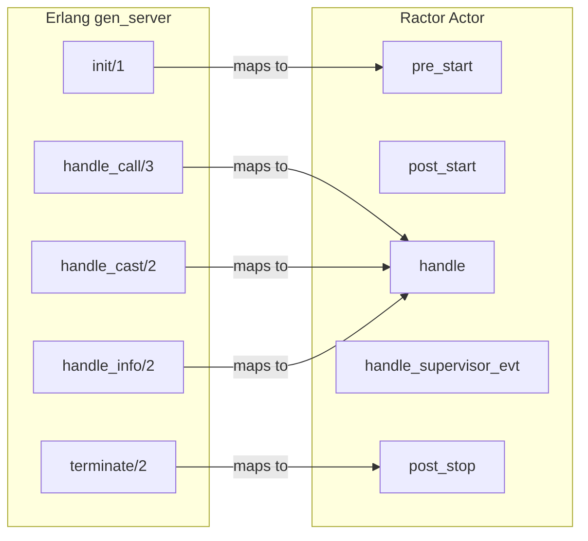

**Erlang gen_server:**
```erlang
-module(counter).
-behaviour(gen_server).

init([Initial]) ->
    {ok, #{count => Initial}}.

handle_call(get, _From, State) ->
    {reply, maps:get(count, State), State};

handle_cast(increment, State) ->
    {noreply, State#{count := maps:get(count, State) + 1}}.

terminate(_Reason, _State) ->
    ok.
```

**Ractor Actor:**
```rust
struct CounterActor;

impl Actor for CounterActor {
    type Msg = CounterMessage;
    type State = CounterState;
    type Arguments = u64;  // Initial count

    async fn pre_start(
        &self,
        _myself: ActorRef<Self::Msg>,
        initial: u64,
    ) -> Result<Self::State, ActorProcessingErr> {
        Ok(CounterState { count: initial })
    }

    async fn handle(
        &self,
        _myself: ActorRef<Self::Msg>,
        message: Self::Msg,
        state: &mut Self::State,
    ) -> Result<(), ActorProcessingErr> {
        match message {
            CounterMessage::Get(reply) => {
                let _ = reply.send(state.count);  // gen_server:reply
            }
            CounterMessage::Increment => {
                state.count += 1;  // noreply
            }
        }
        Ok(())
    }

    async fn post_stop(
        &self,
        _myself: ActorRef<Self::Msg>,
        _state: &mut Self::State,
    ) -> Result<(), ActorProcessingErr> {
        Ok(())
    }
}
```

### 3.2 gen_event → Factory + Workers

Ractor doesn't have a direct `gen_event` equivalent, but the **Factory pattern** provides similar functionality:

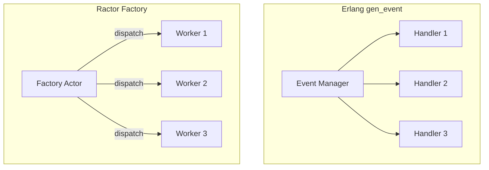

**Factory Routing Strategies:**

| Strategy | Description | Use Case |
|----------|-------------|----------|
| `KeyPersistent` | Same key → Same worker | Session affinity |
| `StickyQueuer` | Sticky hash with overflow | Load balancing with locality |
| `Queuer` | Round-robin with backpressure | Even distribution |
| `RoundRobin` | Pure round-robin | Stateless workers |
| `Custom` | User-defined hash | Application-specific |

### 3.3 gen_fsm/gen_statem → State Pattern in handle()

Ractor doesn't have a dedicated FSM behaviour. State machines are implemented via enum matching:

```rust
enum DoorState {
    Locked,
    Unlocked,
    Open,
}

enum DoorMessage {
    Lock,
    Unlock,
    Push,
}

async fn handle(
    &self,
    _myself: ActorRef<Self::Msg>,
    message: Self::Msg,
    state: &mut Self::State,
) -> Result<(), ActorProcessingErr> {
    *state = match (&state, message) {
        (DoorState::Locked, DoorMessage::Unlock) => DoorState::Unlocked,
        (DoorState::Unlocked, DoorMessage::Lock) => DoorState::Locked,
        (DoorState::Unlocked, DoorMessage::Push) => DoorState::Open,
        (DoorState::Open, DoorMessage::Push) => DoorState::Unlocked,
        (current, _) => current.clone(),  // Ignore invalid transitions
    };
    Ok(())
}
```

### 3.4 OTP Application → No Direct Equivalent

Ractor does not have an "application" abstraction. OTP applications provide:

| OTP Feature | Ractor Alternative |
|-------------|-------------------|
| Application start/stop | Manual orchestration in `main()` |
| Application environment | Rust config crates (e.g., `config`) |
| Application supervisor | Root actor with supervision logic |
| .app file | Cargo.toml |
| Release handling | Standard Rust deployment |

---

## 4. Supervision Trees

### 4.1 Supervision Architecture

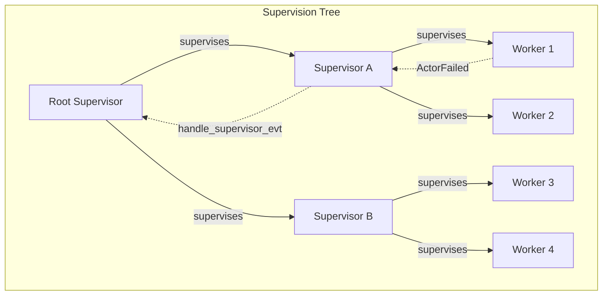

### 4.2 Linking Actors

**Spawn with Linking (Preferred):**
```rust
// Child is linked to parent during spawn
let (child_ref, child_handle) = Actor::spawn_linked(
    Some("child".to_string()),
    ChildActor,
    child_args,
    myself.get_cell(),  // Parent's ActorCell
).await?;
```

**Link After Spawn:**
```rust
// Link existing actors (misses pre_start failures)
child_ref.link(parent_cell);
```

### 4.3 Supervision Events

```rust
pub enum SupervisionEvent {
    /// Child started successfully
    ActorStarted(ActorCell),

    /// Child terminated normally
    ActorTerminated(
        ActorCell,
        Option<BoxedState>,   // Last state if available
        Option<String>,       // Exit reason
    ),

    /// Child panicked or returned error
    ActorFailed(ActorCell, ActorProcessingErr),

    /// Process group membership changed
    ProcessGroupChanged(GroupChangeMessage),
}
```

### 4.4 Supervision Strategies

Unlike Erlang's built-in strategies, Ractor requires manual implementation:

**Erlang:**
```erlang
init([]) ->
    {ok, {{one_for_one, 5, 10}, ChildSpecs}}.
```

**Ractor (Manual Implementation):**
```rust
async fn handle_supervisor_evt(
    &self,
    myself: ActorRef<Self::Msg>,
    message: SupervisionEvent,
    state: &mut Self::State,
) -> Result<(), ActorProcessingErr> {
    match message {
        SupervisionEvent::ActorFailed(who, err) => {
            // One-for-one: restart just the failed child
            if state.restart_count < MAX_RESTARTS {
                state.restart_count += 1;
                let (new_child, _) = Actor::spawn_linked(
                    who.get_name(),
                    ChildActor,
                    state.child_args.clone(),
                    myself.get_cell(),
                ).await?;
                state.children.insert(new_child.get_id(), new_child);
            } else {
                // Max restarts exceeded, propagate failure
                myself.stop(Some("max_restarts_exceeded".to_string()));
            }
        }
        SupervisionEvent::ActorTerminated(who, _, _) => {
            state.children.remove(&who.get_id());
        }
        _ => {}
    }
    Ok(())
}
```

### 4.5 Supervision Strategy Comparison

| Erlang Strategy | Ractor Implementation |
|-----------------|----------------------|
| `one_for_one` | Restart only failed child in `handle_supervisor_evt` |
| `one_for_all` | Stop and restart all children on any failure |
| `rest_for_one` | Track child order, restart failed + subsequent |
| `simple_one_for_one` | Use Factory pattern with worker pool |

---

## 5. Fault Tolerance & Panic Handling

### 5.1 Panic Containment

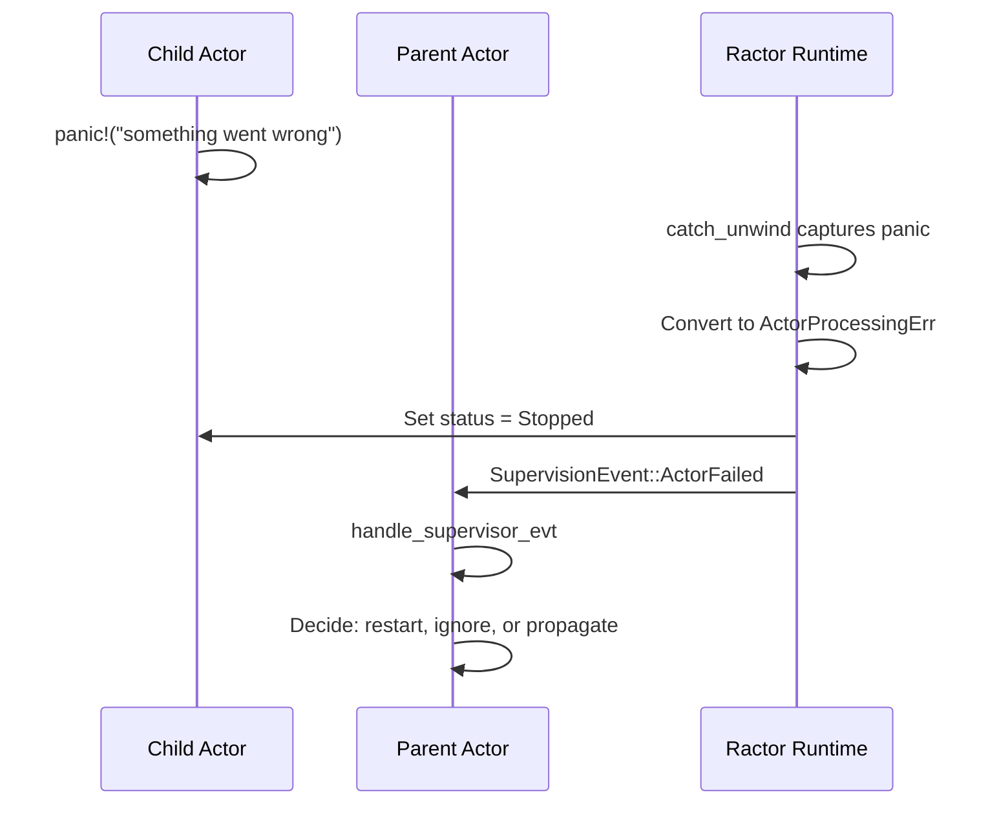

**Panic Capture Implementation:**
```rust
// From actor.rs
fn get_panic_string(e: Box<dyn std::any::Any + Send>) -> ActorProcessingErr {
    match e.downcast::<String>() {
        Ok(v) => From::from(*v),
        Err(e) => match e.downcast::<&str>() {
            Ok(v) => From::from(*v),
            _ => From::from("Unknown panic"),
        },
    }
}

// In processing loop
let result = futures::FutureExt::catch_unwind(
    AssertUnwindSafe(future)
)
.map_err(|err| ActorErr::Failed(get_panic_string(err)))
.await;
```

### 5.2 Where Panics Are Caught

| Lifecycle Phase | Panic Caught? | Supervision Notified? |
|-----------------|---------------|----------------------|
| `pre_start` | No | No (error returned to spawner) |
| `post_start` | Yes | Yes |
| `handle` | Yes | Yes |
| `handle_supervisor_evt` | Yes | Yes |
| `post_stop` | Yes | Yes |

### 5.3 Containment Guarantee

**Important:** Panics are contained to the actor task, NOT the OS process.

```rust
// Panic in actor does NOT crash the program
// (unless panic = "abort" in Cargo.toml)

#[tokio::main]
async fn main() {
    let (actor, handle) = Actor::spawn(None, PanickingActor, ()).await?;

    // Actor panics internally
    actor.cast(TriggerPanic)?;

    // Program continues running
    println!("Main thread still alive!");

    // Handle completes with error
    let result = handle.await;
    assert!(result.is_err());
}
```

### 5.4 Erlang vs Ractor Fault Isolation

| Aspect | Erlang | Ractor |
|--------|--------|--------|
| Process crash isolation | Complete | Complete (per actor) |
| Crash detection | Automatic links/monitors | Supervision events |
| Restart capability | Built-in strategies | Manual implementation |
| Memory isolation | Per-process heap | Shared Rust heap |
| Side effect isolation | Limited | Limited |

---

## 6. Data Storage (ETS/DETS Equivalents)

### 6.1 No Direct ETS/DETS Equivalent

Ractor does not provide ETS-like in-memory tables or DETS-like disk persistence. Alternatives:

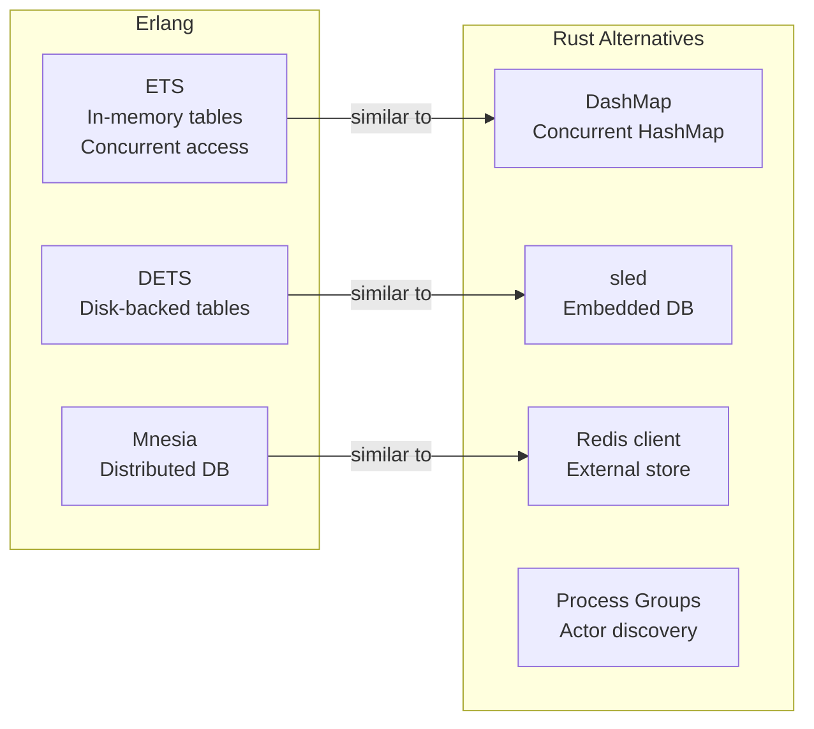

### 6.2 Recommended Patterns

**Shared State via DashMap:**
```rust
use dashmap::DashMap;
use once_cell::sync::Lazy;

static CACHE: Lazy<DashMap<String, Value>> = Lazy::new(DashMap::new);

// In any actor
CACHE.insert("key".to_string(), value);
let val = CACHE.get("key");
```

**State Actor Pattern:**
```rust
struct CacheActor;

enum CacheMessage {
    Get(String, RpcReplyPort<Option<Value>>),
    Put(String, Value),
    Delete(String),
}

impl Actor for CacheActor {
    type State = HashMap<String, Value>;
    // ... serialize access through single actor
}
```

**Persistence with sled:**
```rust
let db = sled::open("my_db")?;
db.insert("key", value.as_bytes())?;
let val = db.get("key")?;
```

---

## 7. Type System & Constraints

### 7.1 Required Trait Bounds

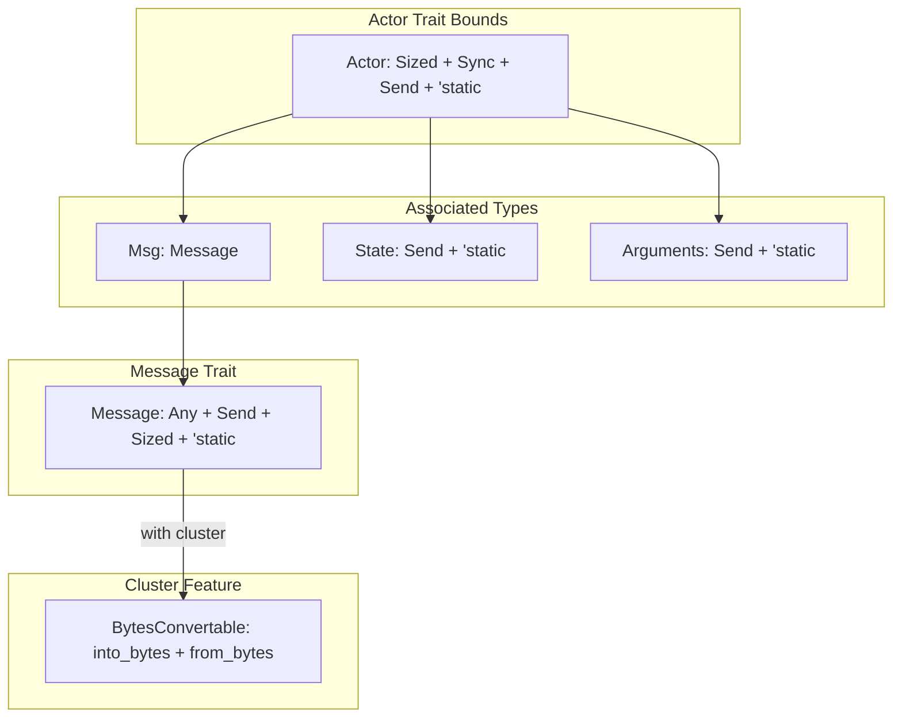

### 7.2 Why These Constraints?

| Constraint | Reason |
|------------|--------|
| `Send` | Actors/messages may move between threads |
| `Sync` | Actor struct accessed from async context |
| `'static` | No borrowed references (actors are long-lived) |
| `Sized` | Concrete types for boxing/unboxing |
| `Any` | Runtime type identification for downcasting |

### 7.3 Async Function Requirement

**All actor methods are `async`:**
```rust
async fn pre_start(...) -> Result<Self::State, ActorProcessingErr>;
async fn post_start(...) -> Result<(), ActorProcessingErr>;
async fn handle(...) -> Result<(), ActorProcessingErr>;
async fn handle_supervisor_evt(...) -> Result<(), ActorProcessingErr>;
async fn post_stop(...) -> Result<(), ActorProcessingErr>;
```

**Sync operations inside async:**
```rust
async fn handle(&self, ...) -> Result<(), ActorProcessingErr> {
    // Sync code is fine
    let result = compute_something();

    // Blocking I/O should use spawn_blocking
    let file_contents = tokio::task::spawn_blocking(|| {
        std::fs::read_to_string("large_file.txt")
    }).await??;

    // Async I/O is native
    let response = reqwest::get("https://api.example.com").await?;

    Ok(())
}
```

### 7.4 Network & File System Access

Actors can freely perform I/O:

```rust
async fn handle(&self, msg: Msg, state: &mut State) -> Result<(), ActorProcessingErr> {
    match msg {
        Msg::FetchUrl(url, reply) => {
            // Network I/O
            let response = reqwest::get(&url).await?;
            let body = response.text().await?;
            let _ = reply.send(body);
        }
        Msg::ReadFile(path, reply) => {
            // File I/O (async)
            let contents = tokio::fs::read_to_string(&path).await?;
            let _ = reply.send(contents);
        }
        Msg::WriteFile(path, data) => {
            tokio::fs::write(&path, &data).await?;
        }
    }
    Ok(())
}
```

---

## 8. Code Loading & Execution

### 8.1 Execution Model

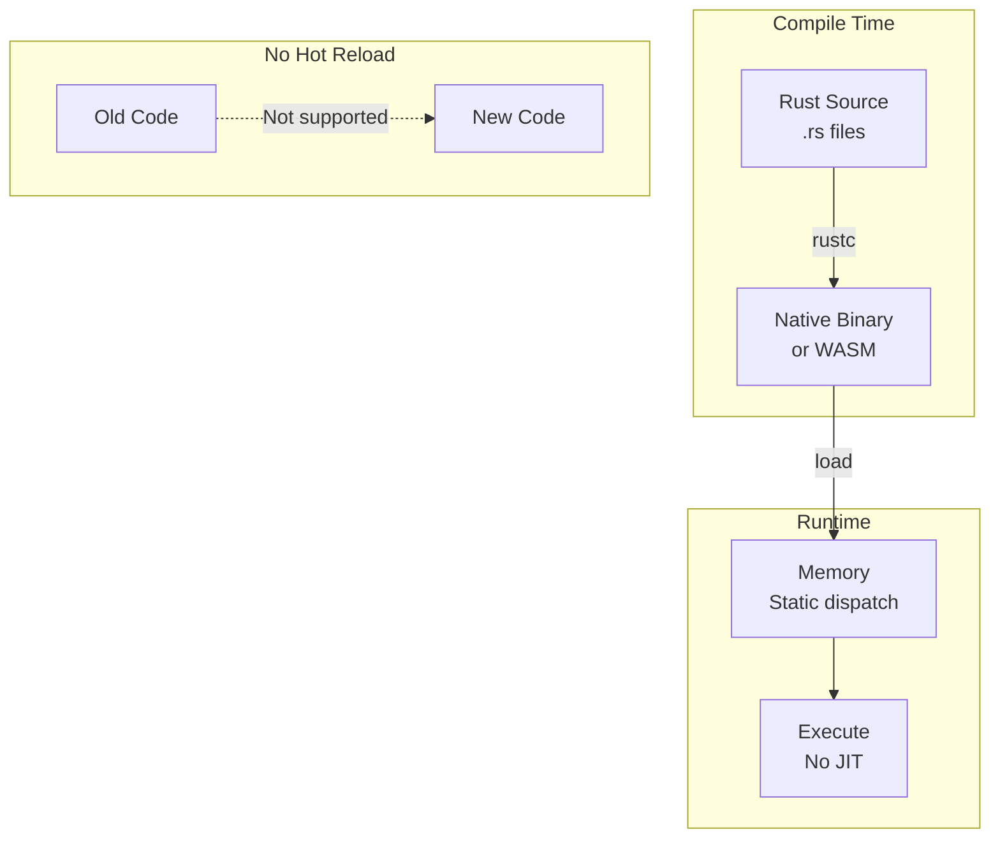

### 8.2 Comparison with Erlang

| Feature | Erlang | Ractor |
|---------|--------|--------|
| Code format | BEAM bytecode | Native machine code |
| Hot code reload | Yes (2 versions) | No |
| Dynamic module loading | Yes (`code:load`) | No (static linking) |
| WASM support | No | Yes (via feature) |
| JIT compilation | Yes (JIT in OTP 24+) | No (AOT only) |

### 8.3 WASM Support

Ractor supports `wasm32-unknown-unknown` target:

```toml
# .cargo/config.toml
[build]
target = "wasm32-unknown-unknown"
```

**Limitations in WASM:**
- No native networking (use browser APIs)
- No filesystem access
- Single-threaded (no true parallelism)
- Timer differences

### 8.4 Actor Upgrade Stub

Ractor has an `Upgrading` status but no implementation:

```rust
pub enum ActorStatus {
    // ...
    Upgrading = 3u8,  // Reserved for future use
    // ...
}
```

---

## 9. Distributed Ractor

### 9.1 Cluster Architecture

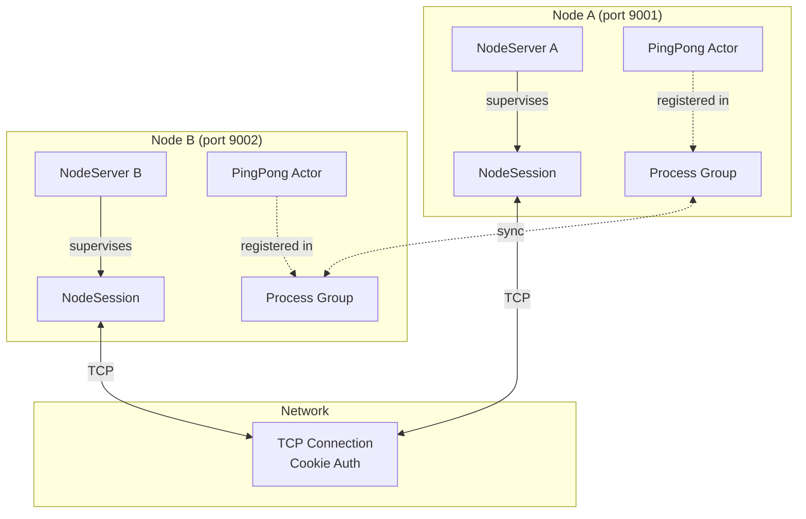

### 9.2 Remote Actor Invocation

**Can code be invoked remotely?**
- Yes, through message passing to remote actors
- Remote actors are "shims" that forward serialized messages
- No remote code execution (code must exist on target node)

**Does code need to exist on the remote node?**
- Yes, the actor implementation must be compiled into the remote node
- Messages are data, not code
- No code shipping like Erlang's `rpc:call`

### 9.3 Message Serialization

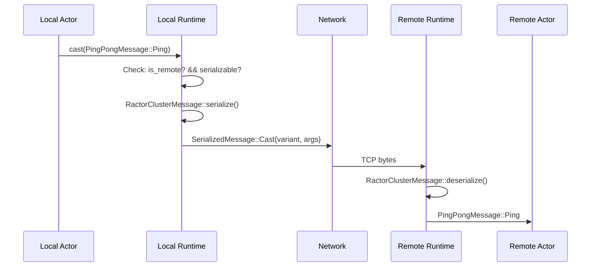

### 9.4 Serialization Requirements

**Using `RactorClusterMessage` derive:**
```rust
use ractor_cluster::RactorClusterMessage;

#[derive(RactorClusterMessage, Debug)]
pub enum MyMessage {
    // Tuple-style fields only (no named fields)
    SimpleVariant,
    WithData(String, u64),

    #[rpc]  // Mark RPC variants
    GetValue(RpcReplyPort<i32>),
}
```

**Using `blanket_serde` feature:**
```rust
// Cargo.toml
ractor = { version = "0.15", features = ["cluster", "blanket_serde"] }

// Any Serialize + Deserialize type works
#[derive(Serialize, Deserialize)]
struct MyData {
    field: String,
}
// BytesConvertable auto-implemented via pot serialization
```

**Manual BytesConvertable:**
```rust
impl BytesConvertable for MyType {
    fn into_bytes(self) -> Vec<u8> {
        // Custom serialization
    }
    fn from_bytes(bytes: Vec<u8>) -> Self {
        // Custom deserialization
    }
}
```

### 9.5 Serialization Format Comparison

| Format | Ractor Support | Notes |
|--------|---------------|-------|
| pot | Default (blanket_serde) | Compact binary |
| JSON | Via serde_json | Human-readable |
| MessagePack | Via rmp-serde | Compact, cross-language |
| Protobuf | Via prost | Schema-based |
| Custom | BytesConvertable impl | Full control |

### 9.6 Process Group Synchronization

Process groups are synchronized across nodes:

```rust
// Node A
ractor::pg::join("my_group".to_string(), vec![actor.get_cell()]);

// Node B (after connection established)
let members = ractor::pg::get_members(&"my_group".to_string());
// Returns both local AND remote actors

// Filter for remote actors
let remote = members.into_iter()
    .filter(|a| !a.get_id().is_local())
    .collect();
```

### 9.7 Distributed Limitations

| Erlang Feature | Ractor Support |
|----------------|---------------|
| Transparent remote calls | Partial (must be serializable) |
| Remote spawn | No |
| Code shipping | No |
| Global process registry | Yes (via process groups) |
| Network partition handling | Basic (session dies) |
| Cookie authentication | Yes |
| TLS encryption | Optional |

---

## 10. Comparison Matrix

### 10.1 Feature Comparison

| Feature | Erlang/OTP | Ractor | Notes |
|---------|------------|--------|-------|
| **Processes** |
| Lightweight processes | Millions | Thousands | Tokio task overhead |
| Preemptive scheduling | Yes | No | Cooperative async |
| Per-process GC | Yes | No | Rust ownership |
| Process isolation | Memory isolated | Shared heap | Different model |
| **Messaging** |
| Ordered mailbox | Yes (FIFO) | No | Priority channels |
| Selective receive | Yes | No | Match in handler |
| Message passing | Copy | Move/Clone | Rust semantics |
| **Supervision** |
| Built-in strategies | Yes | No | Manual impl |
| Restart limits | Built-in | Manual | User responsibility |
| Supervision events | Links/monitors | Events | Similar concept |
| **Fault Tolerance** |
| Panic containment | Yes | Yes | Per-actor |
| Let it crash | Native | Supported | Philosophy works |
| **Distribution** |
| Native clustering | Yes | Optional | Feature flag |
| Transparent remoting | Yes | Partial | Serialization required |
| Hot code reload | Yes | No | Static binary |
| **Type System** |
| Static typing | No | Yes | Rust's strength |
| Message type safety | No | Yes | Compile-time checks |

### 10.2 When to Use Ractor

**Good fit:**
- Type safety is important
- Integration with Rust ecosystem
- Performance-critical actors
- Existing Rust codebase

**Consider alternatives:**
- Need millions of processes → Lunatic (WASM isolation)
- Need hot code reload → Erlang/Elixir
- Need battle-tested distribution → Erlang/Elixir

### 10.3 Migration Path from Erlang

| Erlang Concept | Ractor Approach |
|----------------|-----------------|
| `gen_server` | `Actor` trait |
| `supervisor` | Actor with `handle_supervisor_evt` |
| `gen_event` | Factory pattern |
| `gen_statem` | Enum-based state in handler |
| ETS | DashMap or dedicated cache actor |
| DETS | sled or SQLite |
| Mnesia | External database |
| `application` | main() orchestration |
| `.app` file | Cargo.toml |
| `rpc:call` | Cluster messages |
| `pg` | `ractor::pg` |

---

## Appendix A: Quick Reference

### Actor Trait Methods

```rust
trait Actor {
    type Msg: Message;
    type State: Send + 'static;
    type Arguments: Send + 'static;

    // Required
    async fn pre_start(&self, myself, args) -> Result<State, Err>;

    // Optional (have defaults)
    async fn post_start(&self, myself, state) -> Result<(), Err>;
    async fn handle(&self, myself, msg, state) -> Result<(), Err>;
    async fn handle_supervisor_evt(&self, myself, evt, state) -> Result<(), Err>;
    async fn post_stop(&self, myself, state) -> Result<(), Err>;
}
```

### Spawn Patterns

```rust
// Basic spawn
let (actor, handle) = Actor::spawn(name, handler, args).await?;

// Spawn with supervision link
let (actor, handle) = Actor::spawn_linked(name, handler, args, supervisor).await?;

// Link after spawn
actor.link(supervisor);
```

### Message Patterns

```rust
// Cast (fire-and-forget)
actor.cast(Message::DoSomething)?;

// Call (RPC with reply)
let result = ractor::call!(actor, Message::GetValue)?;

// Call with timeout
let result = ractor::call_t!(actor, Message::GetValue, 1000)?;
```

### Distributed Patterns

```rust
// Join process group
ractor::pg::join("group".to_string(), vec![myself.get_cell()]);

// Find remote actors
let remote = ractor::pg::get_members(&"group".to_string())
    .into_iter()
    .filter(|a| !a.get_id().is_local());

// Connect to remote node
ractor_cluster::client_connect(&node_server, "host:port").await?;
```
