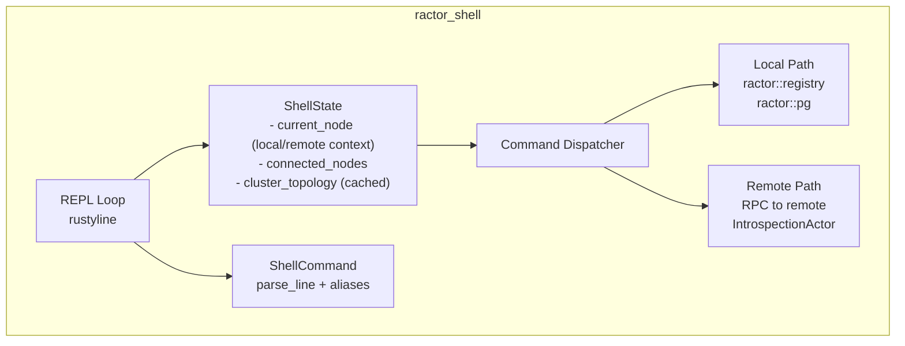

# Ractor Shell

Interactive REPL for Ractor actor systems, inspired by Erlang's `erl` shell.


## Requirements

- **Rust**: 1.75+ (uses native async fn in traits)
- **Runtime**: Tokio (full features)
- **Workspace**: This crate is an optional workspace member of ractor. It is **not** built by default.

### Building

```bash
# Build ractor_shell specifically
cargo build -p ractor_shell

# Run the demo example
cargo run --example demo -p ractor_shell

# Install the shell binary
cargo install --path ractor_shell
```

## Quick Start

### Run the Demo

```bash
cargo run --example demo -p ractor_shell
```

This spawns 3 demo actors and starts the shell. Try:

```
ractor@local > registry
ractor@local > actors
ractor@local > pg members demo_group
ractor@local > info demo_actor_1
ractor@local > stop demo_actor_1
ractor@local > exit
```

### Run the Raft Cluster Demo

Start a 3-node cluster with Raft leader election:

```bash
./ractor_shell/scripts/test_cluster.sh
```

Then query the Raft status:

```
ractor@local > connect 127.0.0.1:9001
✓ Now using 127.0.0.1:9001

ractor@127.0.0.1:9001 > call raft_node GetStatus {}
{
  "leader": "node_a",
  "node_name": "node_a",
  "peers": 2,
  "role": "Leader",
  "term": 6,
  "voted_for": "node_a"
}

ractor@127.0.0.1:9001 > call raft_node IsLeader {}
true

ractor@127.0.0.1:9001 > call raft_node GetPeers {}
["node_b", "node_c"]
```

## Examples

The following examples demonstrate different ractor_shell features:

| Example | Command | Description |
|---------|---------|-------------|
| **demo** | `cargo run --example demo -p ractor_shell` | Basic shell with simple actors. Good starting point for learning shell commands. |
| **dynamic_actor** | `cargo run --example dynamic_actor -p ractor_shell` | Shows how actors can receive JSON messages via `DynamicMessage`. Demonstrates `send` and `call` commands. |
| **monitoring_demo** | `cargo run --example monitoring_demo -p ractor_shell` | Actor lifecycle monitoring with `monitor`, `unmonitor`, and `monitors` commands. |
| **cluster_node** | `cargo run --example cluster_node -p ractor_shell -- --port 9001 --name node_a` | Cluster node with Raft leader election. Use with `test_cluster.sh` for multi-node testing. |

### Example Details

#### demo.rs
The simplest example - spawns 3 named actors in a process group and starts the shell. Use this to explore basic commands like `actors`, `registry`, `pg members`, and `info`.

#### dynamic_actor.rs
Demonstrates the `DynamicMessage` interface that allows actors to receive arbitrary JSON from the shell. The example actor has a counter that can be incremented, reset, and queried:

```bash
send dynamic_actor {"command": "increment"}
call dynamic_actor {"command": "get_counter"}
call dynamic_actor {"command": "add", "amount": 5}
```

#### monitoring_demo.rs
Shows actor lifecycle monitoring. Start monitoring actors to see when they stop or fail:

```bash
monitor demo_actor_1
monitors              # List monitored actors
stop demo_actor_1     # See the stop event
```

#### cluster_node.rs
A full cluster node with:
- `NodeServer` for cluster networking
- `IntrospectionActor` for shell connectivity
- `RaftNode` for leader election

Can be started manually or via the `test_cluster.sh` script.

## Raft Cluster Demo

The shell includes a Raft-based leader election implementation for testing distributed features.

### Quick Start

```bash
# Start a 3-node cluster with interactive shell
./ractor_shell/scripts/test_cluster.sh

# Or start 5 nodes
./ractor_shell/scripts/test_cluster.sh --nodes 5

# Start nodes only (no shell)
./ractor_shell/scripts/test_cluster.sh --no-shell
```

### Raft Commands

Once connected to a cluster node, query the Raft state using typed messages:

| Command | Description |
|---------|-------------|
| `call raft_node IsLeader {}` | Check if this node is the leader |
| `call raft_node GetLeader {}` | Get the current leader's name |
| `call raft_node GetStatus {}` | Full status: role, term, leader, peer count |
| `call raft_node GetPeers {}` | List all known peer nodes |

### Manual Multi-Node Setup

```bash
# Terminal 1: Start node_a (seed node)
cargo run --example cluster_node -p ractor_shell -- --port 9001 --name node_a

# Terminal 2: Start node_b (connects to node_a)
cargo run --example cluster_node -p ractor_shell -- --port 9002 --name node_b --peer 127.0.0.1:9001

# Terminal 3: Start node_c (connects to node_a, discovers node_b)
cargo run --example cluster_node -p ractor_shell -- --port 9003 --name node_c --peer 127.0.0.1:9001

# Terminal 4: Start the shell and connect
cargo run --example demo -p ractor_shell
```

Then in the shell:
```
connect 127.0.0.1:9001
call raft_node GetStatus {}
```

### How It Works

The Raft implementation uses:
- **Direct peer-to-peer communication**: Raft nodes communicate using typed `RaftMessage` over the cluster network
- **Process group peer discovery**: Nodes find each other via the `RAFT_CLUSTER_GROUP` process group
- **Leader election**: Standard Raft protocol with randomized election timeouts
- **Heartbeats**: Leaders send periodic heartbeats to maintain authority
- **Schema-enabled typed messages**: Raft nodes use `RaftMessage` with `#[derive(RactorClusterMessage)]` and `#[ractor_shell]` for typed shell queries

## Shell Commands

| Command | Alias | Description |
|---------|-------|-------------|
| `help [command]` | `h` | Show help/usage |
| `actors` | `a` | List all named actors (local or remote) |
| `registry` | `r` | Show registered actors (local or remote) |
| `pg list` | | List process groups |
| `pg members <group>` | | Show process group members |
| `info <actor>` | `i` | Show actor details |
| `send <actor> <json>` | `s` | Send cast message (fire-and-forget) |
| `call <actor> <json>` | `c` | Send RPC message (request-reply) |
| `send-file <actor> <file>` | | Send message from JSON file |
| `load <script>` | | Execute commands from script file |
| `stop <actor>` | | Stop an actor |
| `connect <host:port>` | `con` | Connect to remote node |
| `disconnect <node>` | `dis` | Disconnect from node |
| `nodes` | `n` | List connected nodes |
| `use <node>` | `u` | Switch to node context |
| `cluster` | `cl` | Show cluster topology |
| `cluster nodes` | | Show all nodes in cluster |
| `cluster groups` | | Show process groups across cluster |
| `cluster actors` | | Show all actors across cluster |
| `stats` | | Show system statistics |
| `tree` | | Show process group tree |
| `monitor <actor>` | `m` | Start monitoring actor events |
| `unmonitor <actor>` | `um` | Stop monitoring an actor |
| `monitors` | `ms` | List monitored actors |
| `top` | `t` | Launch interactive TUI dashboard |
| `trace [pattern]` | `tr` | Start tracing actors matching pattern |
| `trace off` | | Stop all tracing |
| `trace-to-file <path> [pattern]` | `tf` | Log traces to file |
| `trace remote <node> <pattern>` | | Start tracing on remote node |
| `trace remote off` | | Stop remote tracing |
| `schema [--all] <actor>` | `sc` | Show actor message schema (RPC only by default) |
| `exit` / `quit` | `q` | Exit shell |

## Features

### Tab Completion

Press **TAB** for context-aware completion:
- Commands and subcommands
- Actor names (after `info`, `send`, `call`, `stop`, `monitor`)
- Process group names (after `pg members`)
- Node names (after `use`, `disconnect`)

### Command Aliases

Use short forms for faster typing:
- `a` → `actors`
- `r` → `registry`
- `i <actor>` → `info <actor>`
- `s <actor> <msg>` → `send <actor> <msg>`
- `c <actor> <msg>` → `call <actor> <msg>`
- `con <addr>` → `connect <addr>`
- `t` → `top`
- `tr <pattern>` → `trace <pattern>`
- `tf <path>` → `trace-to-file <path>`
- `sc <actor>` → `schema <actor>`

### Dynamic Messages

Actors using `DynamicMessage` as their message type can receive JSON from the shell:

```rust
use ractor_shell::dynamic::DynamicMessage;

impl Actor for MyActor {
    type Msg = DynamicMessage;
    // Handle Cast(json), Call(json, reply), Ping(reply) variants
}
```

See [DYNAMIC_MESSAGES.md](docs/DYNAMIC_MESSAGES.md) for the complete implementation guide.

### Actor Monitoring

Track actor lifecycle events:

```
ractor@local > monitor my_actor
✓ Monitoring my_actor (0.1)

ractor@local > stop my_actor
✓ Sent stop signal to 'my_actor'
[14:24:12.456] ▼ STOPPED my_actor (0.1)
```

See [MONITORING.md](docs/MONITORING.md) for details.

## Configuration

The shell reads configuration from `~/.ractor_shell.toml` if it exists.

### Example Configuration

```toml
# ~/.ractor_shell.toml

# Edit mode: "vi" (default) or "emacs"
# Vi mode uses vim-style keybindings (Esc for normal mode, i for insert, etc.)
# Emacs mode uses readline-style keybindings (Ctrl-A, Ctrl-E, etc.)
edit_mode = "vi"

# Tab completion type: "list" (default) or "circular"
#   list     - shows all matching completions below the prompt
#   circular - cycles through completions with repeated Tab presses
completion_type = "list"

# RPC timeout in seconds (default: 5)
rpc_timeout_secs = 5

# Default node server port when connecting to remote nodes (default: 9100)
node_server_port = 9100

# Cluster authentication cookie (default: "secret_cookie")
cluster_cookie = "my_secret_cookie"

# Auto-connect to a node on startup
# auto_connect = "127.0.0.1:9002"

# Color output: "auto", "always", or "never" (default: "auto")
color = "auto"

# History file location (default: ~/.ractor_shell_history)
# history_file = "/custom/path/history"

# Maximum history entries (default: 1000)
max_history = 1000
```

### Configuration Options

| Option | Default | Description |
|--------|---------|-------------|
| `edit_mode` | `"vi"` | Line editing mode: `"vi"` or `"emacs"` |
| `completion_type` | `"list"` | Tab completion behavior: `"list"` (show all matches) or `"circular"` (cycle through) |
| `rpc_timeout_secs` | `5` | Timeout for RPC calls to actors |
| `node_server_port` | `9100` | Default port when connecting to remote nodes |
| `cluster_cookie` | `"secret_cookie"` | Authentication cookie for cluster connections |
| `auto_connect` | (none) | Auto-connect to this address on startup |
| `color` | `"auto"` | Color output: `"auto"`, `"always"`, or `"never"` |
| `history_file` | `~/.ractor_shell_history` | Path to command history file |
| `max_history` | `1000` | Maximum number of history entries to retain |

### Vi Mode Keys

When `edit_mode = "vi"` (the default):

- **Insert mode** (default when typing): Type normally
- **Esc**: Enter normal mode
- **i**: Enter insert mode
- **h/l**: Move cursor left/right (normal mode)
- **w/b**: Move by word (normal mode)
- **0/$**: Move to start/end of line (normal mode)
- **x**: Delete character (normal mode)
- **dd**: Delete line (normal mode)

### Emacs Mode Keys

When `edit_mode = "emacs"`:

- **Ctrl-A/Ctrl-E**: Move to start/end of line
- **Ctrl-F/Ctrl-B**: Move forward/backward one character
- **Alt-F/Alt-B**: Move forward/backward one word
- **Ctrl-K**: Kill to end of line
- **Ctrl-U**: Kill to start of line
- **Ctrl-W**: Kill previous word

## Use in Your Code

```rust
use ractor_shell::completer::{get_known_process_groups, update_completer_state, ShellHelper};
use ractor_shell::config::ShellConfig;
use ractor_shell::{ShellCommand, ShellState};
use rustyline::{Config, Editor};

#[tokio::main]
async fn main() -> anyhow::Result<()> {
    // Spawn your actors...
    let (actor, _) = Actor::spawn(
        Some("my_actor".to_string()),
        MyActor,
        (),
    ).await?;

    // Start the shell with config-based editor
    let mut state = ShellState::new().await?;

    // Load config from ~/.ractor_shell.toml
    let config = ShellConfig::load();
    let rl_config = Config::builder()
        .edit_mode(config.get_edit_mode())
        .completion_type(config.get_completion_type())
        .build();

    let helper = ShellHelper::new();
    let mut rl = Editor::with_config(rl_config)?;
    rl.set_helper(Some(helper));

    loop {
        // Update tab completion with current actor/group names
        if let Some(helper) = rl.helper_mut() {
            let actor_names = ractor::registry::registered();
            let process_groups = get_known_process_groups();
            let node_names = state.connected_nodes.keys().cloned().collect();
            update_completer_state(helper, actor_names, process_groups, node_names);
        }

        let prompt = state.build_prompt();
        match rl.readline(&prompt) {
            Ok(line) => {
                if let Ok(cmd) = ShellCommand::parse_line(&line) {
                    state.execute(cmd).await?;
                }
                if state.should_exit {
                    break;
                }
            }
            Err(_) => break,
        }
    }

    Ok(())
}
```

## Output Examples

### Actor Listing
```
ractor@local > actors
+--------------+-----+---------+
| Name         | ID  | Status  |
+--------------+-----+---------+
| demo_actor_1 | 0.0 | Running |
| demo_actor_2 | 0.1 | Running |
| demo_actor_3 | 0.2 | Running |
+--------------+-----+---------+
```

### Cluster Topology
```
ractor@local > cluster
Cluster Nodes (3):

+---------+-----------+--------+-------+
| Node ID | Node Name | Actors | Local |
+---------+-----------+--------+-------+
| 1       | node_a    | 3      | yes   |
| 2       | node_b    | 3      | no    |
| 3       | node_c    | 3      | no    |
+---------+-----------+--------+-------+
```

### Raft Status
```
ractor@127.0.0.1:9001 > call raft_node GetStatus {}
{
  "leader": "node_a",
  "node_name": "node_a",
  "peers": 2,
  "role": "Leader",
  "term": 6,
  "voted_for": "node_a"
}
```

## Architecture

See [ARCHITECTURE.md](docs/ARCHITECTURE.md) for detailed component diagrams and design decisions.



## Documentation

| Document | Description |
|----------|-------------|
| [ARCHITECTURE.md](docs/ARCHITECTURE.md) | Internal architecture and design decisions |
| [DYNAMIC_MESSAGES.md](docs/DYNAMIC_MESSAGES.md) | How to create actors that receive JSON from the shell |
| [MONITORING.md](docs/MONITORING.md) | Actor lifecycle monitoring guide |
| [UX_FEATURES.md](docs/UX_FEATURES.md) | Tab completion and command aliases |
| [TESTING.md](docs/TESTING.md) | Testing conventions for contributors |
| [SHOWCASE.md](docs/SHOWCASE.md) | Feature walkthrough with the Raft cluster demo |
| [SKILLS.md](SKILLS.md) | Development best practices |

## Current Limitations

**By design:**
- **Dynamic messages opt-in**: Actors must use `DynamicMessage` as their message type to receive JSON from the shell. This preserves Rust's type safety.

**Requires ractor core API additions:**
- **Named actors only**: Only actors in the registry are visible. Full enumeration needs a `get_all_actors()` API.
- **Process groups instead of supervision trees**: True supervision visualization requires exposing supervision relationships in ractor core.

## Contributing

Contributions welcome! See [ARCHITECTURE.md](docs/ARCHITECTURE.md) for design context.

## License

Same as ractor parent project (MIT).
