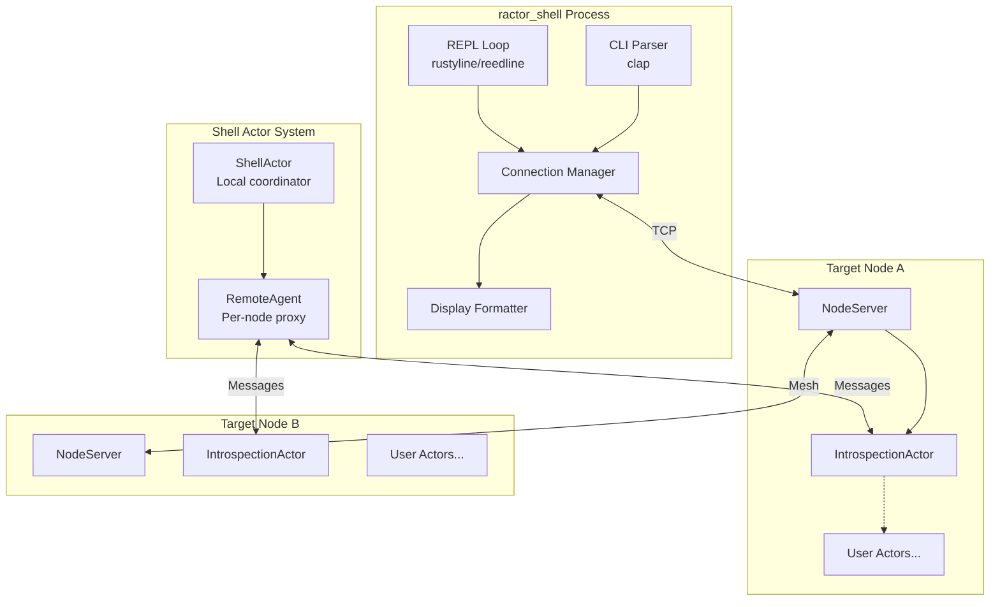
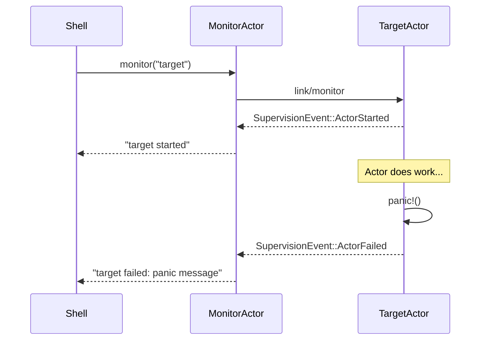
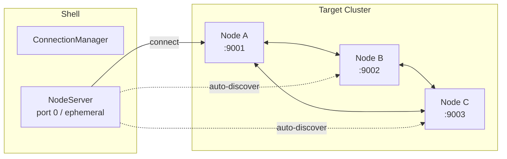
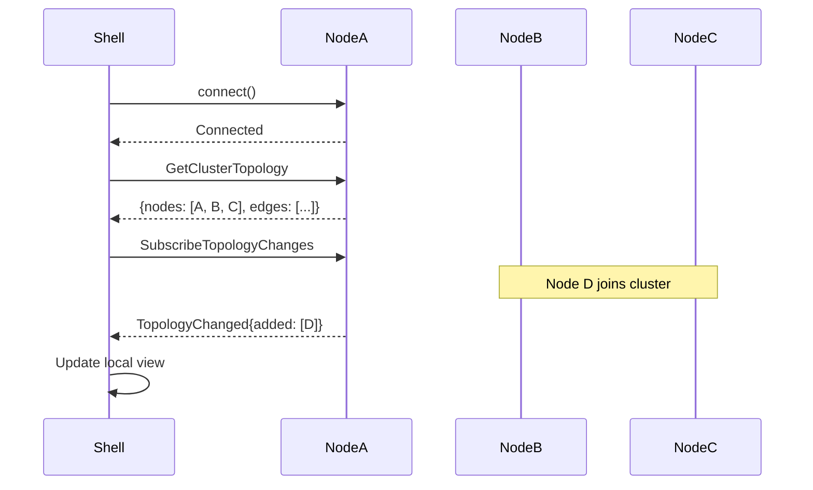

# Ractor REPL/CLI Planning Document

## 1. Project Structure Decision

### Option A: Separate Crate (Recommended)

```
ractor/                          # Existing
ractor_cluster/                  # Existing
ractor_cluster_derive/           # Existing
ractor_shell/                    # NEW - standalone CLI tool
├── Cargo.toml
├── src/
│   ├── lib.rs                   # Library for embedding
│   ├── main.rs                  # Standalone binary
│   ├── commands/                # Command implementations
│   ├── connection/              # Node connection management
│   ├── display/                 # Output formatting
│   └── protocol/                # Shell-specific messages
```

**Pros:**
- No changes to core ractor crate
- Can be installed independently (`cargo install ractor_shell`)
- Clear separation of concerns
- Easier to iterate without affecting core stability
- Users who don't need REPL don't pay for it

**Cons:**
- Separate release cycle
- May need APIs exposed from ractor/ractor_cluster

### Option B: Feature Flag in ractor_cluster

```toml
# In ractor_cluster/Cargo.toml
[features]
default = []
shell = ["rustyline", "clap", "tabled", "crossterm"]
```

**Pros:**
- Single release cycle
- Tighter integration with cluster internals
- Easier access to private APIs

**Cons:**
- Bloats ractor_cluster with optional deps
- Harder to use standalone
- Feature flag complexity

### Option C: Hybrid Approach

- `ractor_shell_core` - Library with shell protocol & introspection traits (in ractor workspace)
- `ractor_shell` - Standalone CLI tool (separate repo or workspace member)

**Recommendation:** Start with **Option A** (separate crate) for initial development. Consider upstreaming introspection APIs to ractor/ractor_cluster as they stabilize.

---

## 2. Architecture Overview



---

## 3. Phased Implementation Plan

### Phase 1: Local Shell Foundation

**Goal:** Basic REPL that works with local actors only

**Commands:**
| Command | Description | Priority |
|---------|-------------|----------|
| `help [command]` | Show help/usage | P0 |
| `actors` | List local actors | P0 |
| `spawn <type> [args]` | Spawn a known actor type | P0 |
| `send <actor> <message>` | Send cast message | P0 |
| `call <actor> <message>` | Send call, show reply | P0 |
| `stop <actor>` | Stop an actor | P0 |
| `exit` / `quit` | Exit shell | P0 |

**Technical Components:**
```rust
// Shell command parsing
#[derive(Parser)]
enum ShellCommand {
    Help { command: Option<String> },
    Actors,
    Spawn { actor_type: String, args: Vec<String> },
    Send { actor: String, message: String },
    Call { actor: String, message: String },
    Stop { actor: String },
    Exit,
}

// Message format for dynamic dispatch
enum DynamicMessage {
    Json(serde_json::Value),
    Text(String),
    Binary(Vec<u8>),
}
```

**Dependencies:**
```toml
[dependencies]
ractor = { version = "0.15", features = ["cluster", "blanket_serde"] }
clap = { version = "4", features = ["derive"] }
rustyline = "14"
serde_json = "1"
tabled = "0.15"          # Pretty table output
colored = "2"            # Terminal colors
```

---

### Phase 2: Introspection & Display

**Goal:** Rich information about actor state and system

**Commands:**
| Command | Description | Priority |
|---------|-------------|----------|
| `info <actor>` | Show actor details (id, status, type) | P1 |
| `tree [actor]` | Show supervision tree | P1 |
| `pg list` | List process groups | P1 |
| `pg members <group>` | Show group members | P1 |
| `registry` | Show named actors | P1 |
| `stats` | System statistics | P1 |

**Introspection Trait (to propose for ractor core):**
```rust
/// Trait for actors that support shell introspection
pub trait Introspectable: Actor {
    /// Return a human-readable description of current state
    fn describe_state(state: &Self::State) -> String {
        "State introspection not implemented".to_string()
    }

    /// Return supported message variants for tab completion
    fn message_variants() -> Vec<MessageVariantInfo> {
        vec![]
    }

    /// Parse a string into a message (for REPL input)
    fn parse_message(input: &str) -> Result<Self::Msg, ParseError> {
        Err(ParseError::NotSupported)
    }
}

#[derive(Debug, Clone)]
pub struct MessageVariantInfo {
    pub name: String,
    pub fields: Vec<FieldInfo>,
    pub is_rpc: bool,
}

#[derive(Debug, Clone)]
pub struct FieldInfo {
    pub name: Option<String>,
    pub type_name: String,
}
```

**Display Formatting:**
```rust
pub trait ShellDisplay {
    fn to_shell_output(&self) -> ShellOutput;
}

pub enum ShellOutput {
    Text(String),
    Table(TableData),
    Tree(TreeData),
    Json(serde_json::Value),
}

// Example: Actor list as table
impl ShellDisplay for Vec<ActorInfo> {
    fn to_shell_output(&self) -> ShellOutput {
        ShellOutput::Table(TableData {
            headers: vec!["ID", "Name", "Status", "Type", "Messages"],
            rows: self.iter().map(|a| vec![
                a.id.to_string(),
                a.name.clone().unwrap_or("-".into()),
                format!("{:?}", a.status),
                a.type_name.clone(),
                a.message_count.to_string(),
            ]).collect(),
        })
    }
}
```

---

### Phase 3: Linking & Monitoring

**Goal:** Interactive observation of actor lifecycle

**Commands:**
| Command | Description | Priority |
|---------|-------------|----------|
| `monitor <actor>` | Subscribe to actor lifecycle events | P2 |
| `unmonitor <actor>` | Unsubscribe from events | P2 |
| `trace <actor> [on\|off]` | Toggle message tracing | P2 |
| `wait <actor>` | Block until actor stops | P2 |

**Architecture:**


**Event Stream:**
```rust
pub enum ShellEvent {
    ActorStarted { id: ActorId, name: Option<String> },
    ActorStopped { id: ActorId, reason: Option<String> },
    ActorFailed { id: ActorId, error: String },
    MessageReceived { actor: ActorId, message: String },
    MessageSent { from: ActorId, to: ActorId, message: String },
    ProcessGroupChanged { group: String, change: GroupChange },
}

// Async event receiver in REPL
async fn repl_loop(mut event_rx: mpsc::Receiver<ShellEvent>) {
    loop {
        tokio::select! {
            // User input
            line = readline() => {
                handle_command(line).await;
            }
            // Background events
            Some(event) = event_rx.recv() => {
                display_event(event);
            }
        }
    }
}
```

---

### Phase 4: File & Message Input

**Goal:** Rich message construction from files/structured input

**Commands:**
| Command | Description | Priority |
|---------|-------------|----------|
| `send-file <actor> <path>` | Send file contents as message | P2 |
| `send-json <actor> <json>` | Send JSON-constructed message | P2 |
| `load <script>` | Execute shell commands from file | P2 |
| `save-output <path>` | Save session output | P3 |

**Message Construction:**
```rust
// Support multiple input formats
enum MessageSource {
    // Inline JSON
    Json(String),
    // File path (auto-detect format)
    File(PathBuf),
    // Simple key=value pairs
    KeyValue(Vec<(String, String)>),
    // Raw bytes (base64 encoded)
    Binary(String),
}

// Message construction with type hints
// > send myactor Ping from_node="shell" count=1
// > send-json myactor {"Ping": ["shell", 1]}
// > send-file myactor ./message.json
```

---

### Phase 5: Remote Node Connection

**Goal:** Connect to running ractor_cluster nodes

**Commands:**
| Command | Description | Priority |
|---------|-------------|----------|
| `connect <host:port>` | Connect to remote node | P1 |
| `disconnect [node]` | Disconnect from node | P1 |
| `nodes` | List connected nodes | P1 |
| `use <node>` | Set default node for commands | P2 |
| `@<node> <command>` | Run command on specific node | P2 |

**Connection Architecture:**


**Protocol Messages:**
```rust
use ractor_cluster::RactorClusterMessage;

#[derive(RactorClusterMessage)]
pub enum ShellProtocolMessage {
    // Introspection requests
    ListActors,
    GetActorInfo(ActorId),
    GetSupervisionTree(Option<ActorId>),
    ListProcessGroups,
    GetProcessGroupMembers(String),
    GetRegisteredActors,
    GetSystemStats,

    // Actor interaction
    SpawnActor(SpawnRequest),
    SendMessage(ActorId, Vec<u8>),
    CallMessage(ActorId, Vec<u8>, #[rpc] RpcReplyPort<Vec<u8>>),
    StopActor(ActorId),

    // Monitoring
    MonitorActor(ActorId),
    UnmonitorActor(ActorId),

    // Responses
    #[rpc]
    ActorList(RpcReplyPort<Vec<ActorInfo>>),
    #[rpc]
    ActorInfoResponse(RpcReplyPort<Option<ActorInfo>>),
    // ... etc
}

#[derive(Serialize, Deserialize)]
pub struct ActorInfo {
    pub id: String,
    pub name: Option<String>,
    pub status: String,
    pub type_name: String,
    pub message_queue_size: usize,
    pub children: Vec<String>,
    pub supervisor: Option<String>,
}
```

---

### Phase 6: Mesh Topology Awareness

**Goal:** Interact with entire cluster through any node

**Commands:**
| Command | Description | Priority |
|---------|-------------|----------|
| `cluster` | Show cluster topology | P3 |
| `cluster actors` | List all actors across cluster | P3 |
| `cluster pg <group>` | Show group members across cluster | P3 |
| `subscribe topology` | Get notified of topology changes | P3 |

**Topology Discovery:**


**Cluster View:**
```rust
#[derive(Debug, Clone, Serialize, Deserialize)]
pub struct ClusterTopology {
    pub nodes: Vec<NodeInfo>,
    pub edges: Vec<(String, String)>,  // Connected pairs
    pub process_groups: HashMap<String, Vec<ActorLocation>>,
}

#[derive(Debug, Clone, Serialize, Deserialize)]
pub struct NodeInfo {
    pub id: String,
    pub name: String,
    pub address: String,
    pub actor_count: usize,
    pub connected_since: Option<String>,
}

#[derive(Debug, Clone, Serialize, Deserialize)]
pub struct ActorLocation {
    pub actor_id: String,
    pub actor_name: Option<String>,
    pub node_id: String,
}
```

**Topology Change Events:**
```rust
pub enum TopologyEvent {
    NodeJoined { node: NodeInfo },
    NodeLeft { node_id: String, reason: String },
    ConnectionEstablished { from: String, to: String },
    ConnectionLost { from: String, to: String },
}
```

---

### Phase 7: Tab Completion & UX Polish

**Goal:** Ergonomic interactive experience

**Features:**
| Feature | Description | Priority |
|---------|-------------|----------|
| Tab completion | Complete commands, actor names, groups | P2 |
| History | Command history with search | P2 |
| Syntax highlighting | Colorize commands and output | P3 |
| Prompt customization | Show current node, connection status | P3 |
| Aliases | User-defined command shortcuts | P4 |

**Tab Completion Implementation:**
```rust
use rustyline::completion::{Completer, Pair};

struct ShellCompleter {
    commands: Vec<String>,
    actor_cache: Arc<RwLock<Vec<String>>>,
    group_cache: Arc<RwLock<Vec<String>>>,
    node_cache: Arc<RwLock<Vec<String>>>,
}

impl Completer for ShellCompleter {
    fn complete(&self, line: &str, pos: usize) -> Result<(usize, Vec<Pair>)> {
        let words: Vec<&str> = line[..pos].split_whitespace().collect();

        match words.as_slice() {
            // Command completion
            [] | [_] => complete_commands(words.last().unwrap_or(&"")),

            // Actor name completion for specific commands
            ["send", partial] | ["call", partial] | ["info", partial] |
            ["stop", partial] | ["monitor", partial] => {
                complete_actors(partial, &self.actor_cache)
            }

            // Group completion
            ["pg", "members", partial] => {
                complete_groups(partial, &self.group_cache)
            }

            // Node completion
            ["connect", partial] | ["use", partial] => {
                complete_nodes(partial, &self.node_cache)
            }

            _ => Ok((pos, vec![])),
        }
    }
}
```

**Dynamic Prompt:**
```rust
fn build_prompt(state: &ShellState) -> String {
    let node_indicator = match &state.current_node {
        Some(node) => format!("@{}", node.name),
        None => "@local".to_string(),
    };

    let connection_status = if state.connected_nodes.is_empty() {
        "".to_string()
    } else {
        format!(" [{}]", state.connected_nodes.len())
    };

    format!("ractor{}{} > ", node_indicator, connection_status)
}

// Examples:
// ractor@local >
// ractor@node_a [3] >
// ractor@node_b [3] >
```

---

## 4. IntrospectionActor Design

For remote introspection to work, target nodes need an actor that responds to shell queries:

```rust
/// Actor that must be spawned on nodes to enable shell introspection
pub struct IntrospectionActor;

pub struct IntrospectionState {
    /// Actors we're monitoring on behalf of shell clients
    monitored: HashMap<ActorId, Vec<ActorRef<ShellProtocolMessage>>>,
    /// Cached actor information
    actor_cache: HashMap<ActorId, ActorInfo>,
    /// Subscribed topology listeners
    topology_subscribers: Vec<ActorRef<ShellProtocolMessage>>,
}

impl Actor for IntrospectionActor {
    type Msg = ShellProtocolMessage;
    type State = IntrospectionState;
    type Arguments = ();

    async fn pre_start(&self, myself: ActorRef<Self::Msg>, _: ())
        -> Result<Self::State, ActorProcessingErr>
    {
        // Join a well-known process group for discovery
        ractor::pg::join(
            "ractor_shell_introspection".to_string(),
            vec![myself.get_cell()]
        );

        Ok(IntrospectionState::default())
    }

    async fn handle(&self, myself: ActorRef<Self::Msg>, msg: Self::Msg, state: &mut Self::State)
        -> Result<(), ActorProcessingErr>
    {
        match msg {
            ShellProtocolMessage::ListActors(reply) => {
                let actors = collect_actor_info();
                let _ = reply.send(actors);
            }

            ShellProtocolMessage::GetSupervisionTree(root, reply) => {
                let tree = build_supervision_tree(root);
                let _ = reply.send(tree);
            }

            ShellProtocolMessage::MonitorActor(target_id) => {
                // Set up monitoring and forward events to shell
            }

            // ... other handlers
        }
        Ok(())
    }
}
```

**Required ractor Core Changes:**

To support full introspection, these APIs would need to be added/exposed:

```rust
// In ractor crate - new module: introspection.rs

/// Get all actors in the system
pub fn get_all_actors() -> Vec<ActorCell> {
    // Need access to internal actor registry
}

/// Get actor's current status
pub fn get_actor_status(id: &ActorId) -> Option<ActorStatus> {
    // Expose ActorCell::get_status()
}

/// Get actor's message queue depth
pub fn get_queue_depth(id: &ActorId) -> Option<usize> {
    // Need access to channel internals
}

/// Get supervision tree starting from an actor
pub fn get_supervision_tree(root: Option<&ActorId>) -> SupervisionTreeView {
    // Walk SupervisionTree structures
}
```

---

## 5. Security Considerations

### Authentication

```rust
pub struct ShellAuthConfig {
    /// Required cookie for shell connections (like Erlang)
    pub cookie: Option<String>,

    /// Allowed operations for authenticated shells
    pub permissions: ShellPermissions,

    /// IP allowlist for shell connections
    pub allowed_ips: Option<Vec<IpAddr>>,
}

#[derive(Default)]
pub struct ShellPermissions {
    pub can_spawn: bool,
    pub can_stop: bool,
    pub can_send: bool,
    pub can_introspect: bool,
    pub can_monitor: bool,
}

// Read-only shell for production
let readonly_shell = ShellPermissions {
    can_introspect: true,
    can_monitor: true,
    ..Default::default()
};
```

### Sandboxing

```rust
// Limit what types of actors can be spawned from shell
pub trait ShellSpawnable: Actor {
    /// Human-readable type name for shell
    fn shell_type_name() -> &'static str;

    /// Parse arguments from shell input
    fn parse_shell_args(args: &[String]) -> Result<Self::Arguments, ParseError>;
}

// Registry of spawnable types
static SPAWNABLE_TYPES: Lazy<HashMap<String, SpawnFn>> = Lazy::new(|| {
    let mut m = HashMap::new();
    m.insert("counter".to_string(), spawn_counter as SpawnFn);
    m.insert("echo".to_string(), spawn_echo as SpawnFn);
    m
});
```

---

## 6. Example Session

```
$ ractor-shell
ractor@local > help
Available commands:
  actors              List all actors
  connect <addr>      Connect to remote node
  nodes               List connected nodes
  spawn <type> [args] Spawn an actor
  send <actor> <msg>  Send a message (cast)
  call <actor> <msg>  Send a message (call, wait for reply)
  info <actor>        Show actor details
  tree [actor]        Show supervision tree
  pg list             List process groups
  pg members <group>  Show process group members
  monitor <actor>     Monitor actor lifecycle
  stop <actor>        Stop an actor
  exit                Exit shell

ractor@local > connect 192.168.1.100:9001
Connected to node_a (192.168.1.100:9001)
Discovered 2 additional nodes: node_b, node_c

ractor@local [3] > nodes
┌──────────┬─────────────────────┬────────┬───────────┐
│ Name     │ Address             │ Actors │ Connected │
├──────────┼─────────────────────┼────────┼───────────┤
│ node_a   │ 192.168.1.100:9001  │ 12     │ 2m ago    │
│ node_b   │ 192.168.1.101:9001  │ 8      │ 2m ago    │
│ node_c   │ 192.168.1.102:9001  │ 15     │ 2m ago    │
└──────────┴─────────────────────┴────────┴───────────┘

ractor@local [3] > use node_a

ractor@node_a [3] > actors
┌────────┬─────────────┬─────────┬──────────────────┬──────────┐
│ ID     │ Name        │ Status  │ Type             │ Messages │
├────────┼─────────────┼─────────┼──────────────────┼──────────┤
│ 0.0    │ node_server │ Running │ NodeServer       │ 0        │
│ 0.1    │ listener    │ Running │ Listener         │ 0        │
│ 0.2    │ ping_pong   │ Running │ PingPongActor    │ 0        │
│ 0.3    │ session_1   │ Running │ NodeSession      │ 0        │
│ ...    │ ...         │ ...     │ ...              │ ...      │
└────────┴─────────────┴─────────┴──────────────────┴──────────┘

ractor@node_a [3] > tree
node_server (0.0)
├── listener (0.1)
├── session_1 (0.3)
│   └── tcp_handler (0.4)
└── session_2 (0.5)
    └── tcp_handler (0.6)

ping_pong (0.2) [orphan]

ractor@node_a [3] > pg list
┌─────────────────────────────┬─────────┬───────┐
│ Group                       │ Members │ Scope │
├─────────────────────────────┼─────────┼───────┤
│ ping_pong                   │ 3       │ global│
│ ractor_shell_introspection  │ 3       │ global│
└─────────────────────────────┴─────────┴───────┘

ractor@node_a [3] > pg members ping_pong
┌────────┬───────────┬────────┐
│ Actor  │ Name      │ Node   │
├────────┼───────────┼────────┤
│ 0.2    │ ping_pong │ node_a │
│ 0.2    │ ping_pong │ node_b │
│ 0.2    │ ping_pong │ node_c │
└────────┴───────────┴────────┘

ractor@node_a [3] > info 0.2
Actor: ping_pong (0.2)
  Status:     Running
  Type:       PingPongActor
  Node:       node_a
  Supervisor: None
  Children:   0
  Queue:      0 messages
  Uptime:     5m 32s

  State (if introspectable):
    node_name: "node_a"
    is_initiator: true
    pings_sent: 10
    pongs_sent: 0
    pings_received: 0
    pongs_received: 9
    done: true

ractor@node_a [3] > monitor 0.2
Now monitoring ping_pong (0.2)

ractor@node_a [3] > send 0.2 Ping("shell", 1)
Message sent.

[event] ping_pong (0.2) received message

ractor@node_a [3] > call 0.2 GetStats
Response: PingPongStats { pings_sent: 11, pongs_sent: 0, pings_received: 1, pongs_received: 9 }

ractor@node_a [3] > cluster
Cluster Topology:
  node_a ←→ node_b
  node_a ←→ node_c
  node_b ←→ node_c

Total: 3 nodes, 35 actors

ractor@node_a [3] > subscribe topology
Subscribed to topology changes.

[topology] Node node_d joined cluster
[topology] Connection established: node_a ←→ node_d

ractor@node_a [4] > exit
Disconnecting from 4 nodes...
Goodbye!
```

---

## 7. Implementation Milestones

### Milestone 1: MVP (2-3 weeks)
- [ ] Project setup with clap + rustyline
- [ ] Basic command parsing
- [ ] Local actor listing (`actors`)
- [ ] Local actor info (`info`)
- [ ] Process group queries (`pg list`, `pg members`)
- [ ] Registry queries (`registry`)
- [ ] `help` command

### Milestone 2: Interaction (1-2 weeks)
- [ ] `send` command (cast)
- [ ] `call` command (RPC)
- [ ] `stop` command
- [ ] Basic output formatting with tabled

### Milestone 3: Remote Connection (2-3 weeks)
- [ ] `IntrospectionActor` implementation
- [ ] Shell protocol messages
- [ ] `connect`/`disconnect` commands
- [ ] `nodes` command
- [ ] `use` command for node switching

### Milestone 4: Monitoring (1-2 weeks)
- [ ] `monitor`/`unmonitor` commands
- [ ] Async event display in REPL
- [ ] `trace` command

### Milestone 5: Cluster Awareness (2 weeks)
- [ ] Topology discovery
- [ ] `cluster` commands
- [ ] Topology change subscription

### Milestone 6: Polish (1-2 weeks)
- [ ] Tab completion
- [ ] Command history
- [ ] Syntax highlighting
- [ ] Configuration file support

---

## 8. Open Questions

1. **Message Type Registration**: How do we make arbitrary user message types sendable from shell?
   - Option A: Require `Introspectable` trait with parse_message
   - Option B: JSON-only for shell messages
   - Option C: Code generation / reflection

2. **Actor Discovery**: How do we enumerate all actors?
   - ractor currently doesn't expose a global actor list
   - Need to propose API additions to ractor core

3. **State Introspection**: How deep should state visibility go?
   - Debug trait for automatic formatting?
   - Custom `ShellDisplay` trait?
   - Privacy concerns for production systems?

4. **Backwards Compatibility**: Should shell protocol be versioned?
   - Shell v1 connecting to older nodes?
   - Protocol negotiation?

5. **Contribution Strategy**:
   - Build entirely external first, then propose upstream?
   - Collaborate with ractor maintainer early?
   - Start a discussion/RFC on ractor GitHub?

---

## 9. Next Steps

1. **Create `ractor_shell` crate** as workspace member
2. **Implement Phase 1** commands with local-only scope
3. **Design `IntrospectionActor`** protocol
4. **Propose ractor core changes** for actor enumeration
5. **Engage with ractor maintainer** on GitHub for feedback
