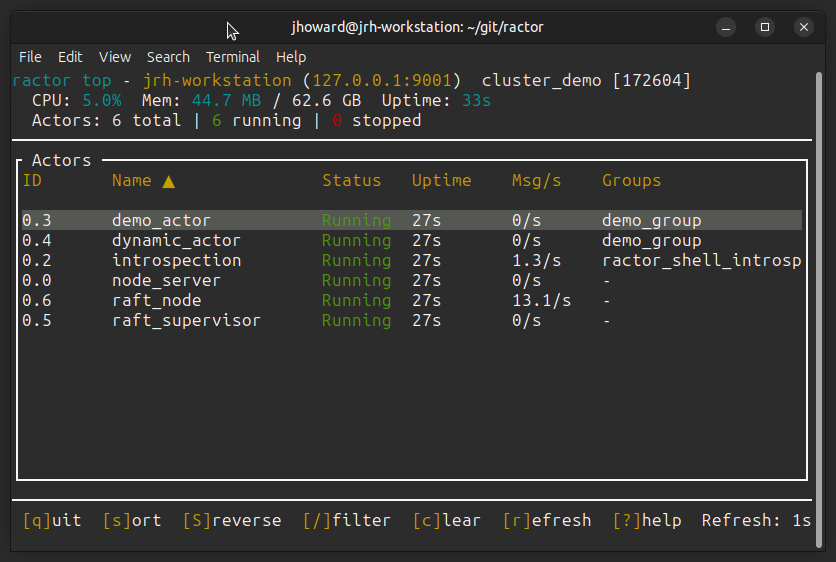

# ractor_shell Feature Showcase

This guide demonstrates key ractor_shell features using the Raft cluster demo.
The Raft cluster itself isn't intended for production use, it's only here to serve as an example of how ractor_shell could be used.

## Prerequisites

Build the project:
```bash
cargo build -p ractor_shell --examples
```

---

## 1. Start the Raft Cluster

In one terminal, start the 3-node cluster:

```bash
./ractor_shell/scripts/test_cluster.sh
```

This starts:
- **node_a** on port 9001 (shell connects here by default)
- **node_b** on port 9002
- **node_c** on port 9003

Wait for "All nodes started" message.

---

## 2. Connect to the Remote Nodes

The shell starts automatically after the cluster is ready. Connect to all three nodes so they're available for later tracing:

```
ractor@local > connect 127.0.0.1:9001
✓ Connected to 127.0.0.1:9001

ractor@127.0.0.1:9001 > connect 127.0.0.1:9002
✓ Connected to 127.0.0.1:9002

ractor@127.0.0.1:9002 > connect 127.0.0.1:9003
✓ Connected to 127.0.0.1:9003

ractor@127.0.0.1:9003 > use 127.0.0.1:9001
✓ Switched to 127.0.0.1:9001
```

The prompt changes to show the currently active connection. Use `use <port>` to switch between connected nodes.

---

## 3. Explore the Cluster

### List all actors on the remote node:
```
ractor@127.0.0.1:9001 > actors
```

### Show registered actors:
```
ractor@127.0.0.1:9001 > registry
```

### Show cluster topology:
```
ractor@127.0.0.1:9001 > cluster
```

### List process groups:
```
ractor@127.0.0.1:9001 > pg list
```

### Show process group members:
```
ractor@127.0.0.1:9001 > pg members raft_cluster
```

---

## 4. Query Raft Status

### Get full Raft node status:
```
ractor@127.0.0.1:9001 > call raft_node GetStatus {}
{
  "election_generation": 4761,
  "leader": "node_c",
  "ms_since_heartbeat": 27,
  "node_name": "node_a",
  "peer_names": [
    "node_c",
    "node_b"
  ],
  "role": "Follower",
  "term": 6,
  "voted_for": null,
  "votes_received": 0
}
```

The status shows:
- `peer_names`: List of known peer node names
- `election_generation`: How many times the election timer has been reset
- `ms_since_heartbeat`: Milliseconds since last heartbeat (followers only, null for leaders)
- `votes_received`: Vote count during elections

### Check if this node is the leader:
```
ractor@127.0.0.1:9001 > call raft_node IsLeader {}
false
```

### Get the current leader's name:
```
ractor@127.0.0.1:9001 > call raft_node GetLeader {}
"node_c"
```

### List known peers:
```
ractor@127.0.0.1:9001 > call raft_node GetPeers {}
[
  "node_c",
  "node_b"
]
```

---

## 5. RPC with Arguments

### Check if a specific node is a known peer:
```
ractor@127.0.0.1:9001 > call raft_node IsPeer {"peer_name": "node_b"}
true

ractor@127.0.0.1:9001 > call raft_node IsPeer {"peer_name": "node_c"}
true

ractor@127.0.0.1:9001 > call raft_node IsPeer {"peer_name": "unknown_node"}
false
```

### View the message schema to see available RPCs:
```
ractor@127.0.0.1:9001 > schema raft_node
Message schema for raft_node

  GetLeader (RPC):
    (no fields)
    → returns: Option<String>

  GetPeers (RPC):
    (no fields)
    → returns: Vec<String>

  GetStatus (RPC):
    (no fields)
    → returns: RaftStatus

  IsLeader (RPC):
    (no fields)
    → returns: bool

  IsPeer (RPC):
    peer_name: String
    → returns: bool

  StepDown (RPC):
    (no fields)
    → returns: bool

  (6 internal variants hidden, use --all to show)
```

By default, `schema` only shows RPC variants (methods you can call from the shell).
Use `--all` to see internal message variants too:

```
ractor@127.0.0.1:9001 > schema --all raft_node
Message schema for raft_node

  DiscoverPeers (Cast):
    generation: u64

  ElectionTimeout (Cast):
    generation: u64

  GetLeader (RPC):
    (no fields)
    → returns: Option<String>
  ...
```

### Named Fields with `#[fields(...)]`

Message variants can use the `#[fields(...)]` attribute to provide human-readable
field names instead of ordinal positions. This makes the shell interface more
intuitive without changing the binary wire protocol.

**Without `#[fields]`** (ordinal positions):
```rust
IsPeer(String, RpcReplyPort<bool>)
```
```
call raft_node IsPeer {"0": "node_b"}
```

**With `#[fields(peer_name)]`** (named field):
```rust
#[rpc]
#[fields(peer_name)]
IsPeer(String, RpcReplyPort<bool>)
```
```
call raft_node IsPeer {"peer_name": "node_b"}
```

The `schema` command shows the field names in use, making it easy to discover
the correct JSON format for each RPC variant.

---

## 6. Supervision Tree Visualization

### Show the full supervision tree:
```
ractor@127.0.0.1:9001 > supervtree
```

### Show tree for a specific actor:
```
ractor@127.0.0.1:9001 > supervtree raft_supervisor
```

### Get parent of an actor:
```
ractor@127.0.0.1:9001 > parent raft_node
```

### Get detailed info about an actor:
```
ractor@127.0.0.1:9001 > info raft_node
```

---

## 7. Enable Tracing for Raft Events

**Important**: The Raft actors run in the cluster node processes, not the shell. Use `trace remote` to capture their events.

### Set minimum level to INFO first (avoid noisy TRACE/DEBUG):
```
ractor@127.0.0.1:9001 > trace level INFO
✓ Minimum trace level set to: INFO
```

### Subscribe to remote traces from all nodes:
```
ractor@127.0.0.1:9001 > trace remote 127.0.0.1:9001 *raft*
✓ Subscribed to traces from 127.0.0.1:9001 matching: raft*

ractor@127.0.0.1:9001 > trace remote 127.0.0.1:9002 *raft*
✓ Subscribed to traces from 127.0.0.1:9002 matching: raft*

ractor@127.0.0.1:9001 > trace remote 127.0.0.1:9003 *raft*
✓ Subscribed to traces from 127.0.0.1:9003 matching: raft*
```

This will capture:
- Leader elections
- Role transitions
- Vote requests/responses
- Step-down events

### Alternative: trace by node name field (matches field values):
```
ractor@127.0.0.1:9001 > trace remote 127.0.0.1:9001 node_*
```

### Check active traces:
```
ractor@127.0.0.1:9001 > trace
Active patterns: ...
Minimum level: INFO
```

---

## 8. Monitor Actor Lifecycle Events

### Start monitoring the Raft node:
```
ractor@127.0.0.1:9001 > monitor raft_node
✓ Now monitoring: raft_node
```

### List monitored actors:
```
ractor@127.0.0.1:9001 > monitors
Monitored Actors on 127.0.0.1:9001:
  • raft_node
```

---

## 9. Trigger Leader Election

### Find and switch to the current leader:

First, check which node is leader:
```
ractor@127.0.0.1:9001 > call raft_node GetLeader {}
"node_c"
```

Switch to the leader node (we connected to all nodes in step 2):
```
# If node_b is leader:
ractor@127.0.0.1:9001 > use 127.0.0.1:9002
✓ Switched to 127.0.0.1:9002

# Or if node_c is leader:
ractor@127.0.0.1:9001 > use 127.0.0.1:9003
✓ Switched to 127.0.0.1:9003
```

Verify you're on the leader:
```
ractor@127.0.0.1:9003 > call raft_node IsLeader {}
true
```

### Subscribe to traces before triggering election:
```
ractor@127.0.0.1:9003 > trace remote 127.0.0.1:9003 *raft*
✓ Subscribed to traces from 127.0.0.1:9003 matching: raft*
```

### Force the leader to step down:
```
ractor@127.0.0.1:9003 > call raft_node StepDown {}
true
```

### Observe the election in trace output:
You should see trace events like:
```
[INFO] raft_node "Stepping down from leader role" node="node_b" term=4
[INFO] raft_node "Starting election" node="node_a"
[INFO] raft_node "Won election, becoming leader" node="node_a"
```

Note: Events appear as they're polled from the remote node. There may be a slight delay.

### Stop tracing:
```
ractor@127.0.0.1:9003 > trace off
✓ Stopped 5 remote trace subscriptions
```

### Verify new leader:
```
ractor@127.0.0.1:9003 > call raft_node GetLeader {}
"node_b"
```

---

## 10. Interactive TUI Dashboard

The `top` command provides a real-time dashboard of actors. It works both locally and on remote nodes.

### Launch the dashboard:
```
ractor@127.0.0.1:9001 > top
```



When connected to a remote node:
- Header shows: "ractor top - 127.0.0.1:9001 (remote)"
- Displays actors registered on that remote node
- Real-time updates fetched via RPC every second

**Navigation:**
- `↑/↓` or `j/k` - Navigate actor list
- `s` - Change sort column
- `S` - Toggle sort direction
- `/` - Filter actors by name
- `c` - Clear filter
- `r` - Refresh
- `?` - Show help
- `q` - Quit

---

## 11. Save Traces to File

### Write traces to a file:
```
ractor@127.0.0.1:9001 > trace-to-file /tmp/raft_trace.log
✓ Tracing to file: /tmp/raft_trace.log
```

### Trigger some activity, then view the log:
```bash
cat /tmp/raft_trace.log
```

---

## 12. Cleanup

### Stop tracing:
```
ractor@127.0.0.1:9001 > trace off
✓ All tracing stopped
```

### Stop monitoring:
```
ractor@127.0.0.1:9001 > unmonitor raft_node
✓ Stopped monitoring: raft_node
```

### Disconnect:
```
ractor@127.0.0.1:9001 > disconnect 127.0.0.1:9001
✓ Disconnected
```

### Exit the shell:
```
ractor@local > exit
```

### Stop the cluster:
Press `Ctrl+C` in the test_cluster.sh terminal, or:
```bash
pkill -f cluster_demo
```

---

## Quick Reference

| Command | Description |
|---------|-------------|
| `connect <host:port>` | Connect to remote node |
| `reconnect <node>` | Refresh stale connection |
| `actors` / `a` | List all actors |
| `registry` / `r` | List registered actors |
| `info <actor>` / `i` | Show actor details |
| `call <actor> <Variant> <json>` / `c` | Call RPC on actor |
| `schema [--all] <actor>` | Show message schema (RPC only by default) |
| `supervtree` / `st` | Show supervision tree |
| `parent <actor>` / `p` | Show actor's parent |
| `pg list` | List process groups |
| `pg members <group>` | List group members |
| `cluster` | Show cluster topology |
| `trace <pattern>` | Start local tracing |
| `trace remote <node> <pattern>` | Subscribe to remote traces |
| `trace level <level>` | Set min trace level |
| `trace off` | Stop all tracing (local + remote) |
| `trace remote off` | Stop only remote trace subscriptions |
| `monitor <actor>` | Monitor lifecycle |
| `monitors` | List monitored actors |
| `top` / `t` | Interactive dashboard |
| `stop <actor>` | Stop an actor |
| `help` | Show all commands |

---

## Troubleshooting

### "No introspection actor found"
- Make sure you're connected to a cluster node, not just any TCP port
- Check that the node is fully started

### Traces not appearing
- **For remote actors**: Use `trace remote <node> <pattern>`, not just `trace`
- The `trace` command only captures events in the shell's own process
- **Pattern matching**: Use `*raft*` not `raft*` to match module paths like `cluster_demo::raft`
- Verify trace pattern matches: `trace` (no args) shows active patterns
- Check trace level: `trace level` - events below this level are filtered
- Try `trace remote <node> *` to capture everything from a node

### RPC timeout
- Default timeout is 5 seconds
- Check that the target actor is running: `registry`
- Check actor status: `info <actor>`

### "Failed to send message: SendErr"
- The cluster connection may have dropped or the actor reference became stale
- Use `reconnect <node>` to refresh the connection
- Example: `reconnect 127.0.0.1:9002`
